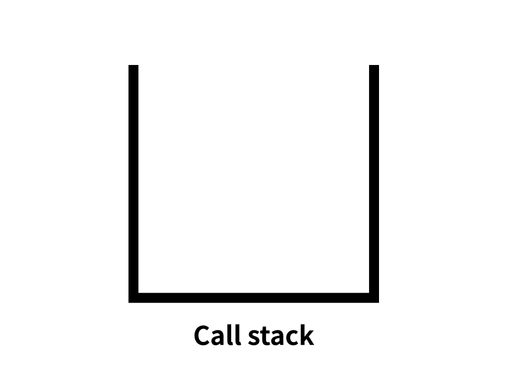

# Execution context
- JS 코드가 실행되고 연산되는 범위를 나타내는 추상적인 개념.
- 함수를 실행할 때 필요한 조건, 환경정보를 담은 **객체**
- **함수**에 의해서만 컨텍스트를 구분할 수 있음.

- **Execution**: 동일한 조건, 환경을 지니는 코드 뭉치
    - 전역공간
    - **함수**
    - eval
    - module

- **Context**: ↑↑↑↑↑...를 실행할 때 필요한 조건, 환경정보

## 3가지 환경 정보 (구성)
현재 환경과 관련된 식별자 정보들이 담김.
### 1) VariableEnvironment
- 오직 식별자 정보를 수집하는 용도로만 쓰임.
- 변화 반영 X

### 2) LexicalEnvironment
- 각 식별자에 담긴 데이터를 추적하는 용도로 쓰임.
- 변화 반영 O

- 어휘적 / 사전적 환경: 실행컨텍스트를 구성하는 환경정보들을 모아 사전처럼 구성한 객체  

#### environmentRecord
- 환경 기록. **현재 컨텍스트 내부**의 식별자 (hoisting)
    - **Hoistiong** : 현재 컨텍스트 내부의 식별자를 수집해서 environmentRecord에 담는 과정에서 식별자 정보를 실행 컨텍스트의 맨 위로 끌어올리는 것.
    - 함수 선언문 전체를 끌어올림.  

#### outerEnvironmentReference
- **외부** 식별자 (scope chain).  
    - **Scope Chain**: 가장 가까운 자기 자신부터 점점 멀리있는 스코프로 찾아 나가는 것.
    - 상위 스코프의 LexicalEnvironment를 참조할 수는 있어도, 하위로 내려갈 수는 없다.

### 3) ThisBinding
> 다음 강의에서

## Call stack (콜스택)
- 현재 어떤 함수가 동작중인지, 다음에 어떤 함수가 호출될 예정인지 등을 제어하는 자료구조
- 콜스택에 실행 컨텍스트가 쌓이고, 빠짐. 
- 모든 실행 컨텍스트가 빠지면 '더 이상 실행할 내용이 없다' 고 판단해서 종료.

```js
var a = 1;              // (1) 전역 context

function outer() {      // (3) outer 실행
    console.log(a);

    function inner() {  // (5) inner 실행
        console.log(a);
        var a = 3;      // (6) inner 종료
    }

    inner();            // (4) inner 호출

    console.log(a);     // (7) outer 종료
}
outer();                // (2) outer 호출
console.log(a);         // (8) 전역 context 종료
```

